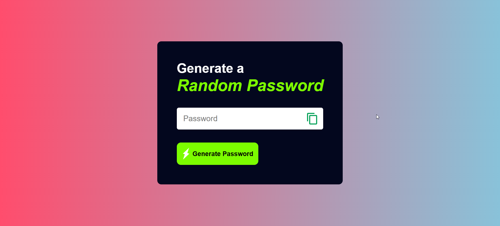

# 🔐 Random Password Generator

A simple and secure **Random Password Generator** built using **HTML, CSS, and JavaScript**. This application helps users generate strong passwords instantly with customizable options for better security.

---

## 📌 Features

✅ Generate strong random passwords  
✅ Copy password to clipboard with one click  
✅ Include uppercase letters (A-Z)  
✅ Include lowercase letters (a-z)  
✅ Include numbers (0-9)  
✅ Include special characters (@, #, $, %, &, etc.)  
✅ Adjustable password length  
✅ Responsive design for all devices  
✅ User-friendly interface

---

## 📸 Screenshots

### Home Page





### Generated Password


---

## 🛠️ Technologies Used

- HTML5
- CSS3
- JavaScript (ES6)

---

## 📂 Project Structure

```bash
Password_Generator/
│
├── index.html
├── style.css
├── app.js
│
├── screenshots/
│   ├── home.png
│   └── password-generated.png
│
└── README.md
```

---

## ⚙️ Installation

### 1️⃣ Clone the Repository

```bash
git clone https://github.com/Pinkykumari9546/Password_Generator.git
```

### 2️⃣ Navigate to the Project Folder

```bash
cd Password_Generator
```

### 3️⃣ Open in Browser

Simply open the `index.html` file in your browser.

---

## 🎯 How to Use

1. Open the application.
2. Click **Generate Password**.
3. Copy the generated password using the copy button.
4. Use the password wherever needed.

---

## 🔒 Password Strength Tips

- Use at least 12 characters.
- Include uppercase and lowercase letters.
- Add numbers and special symbols.
- Avoid using personal information.
- Never reuse passwords across multiple accounts.

---

## 👩‍💻 Author

**Pinky Kumari**

GitHub: https://github.com/Pinkykumari9546

---

## ⭐ Support

If you found this project useful, please give it a ⭐ on GitHub!

---
